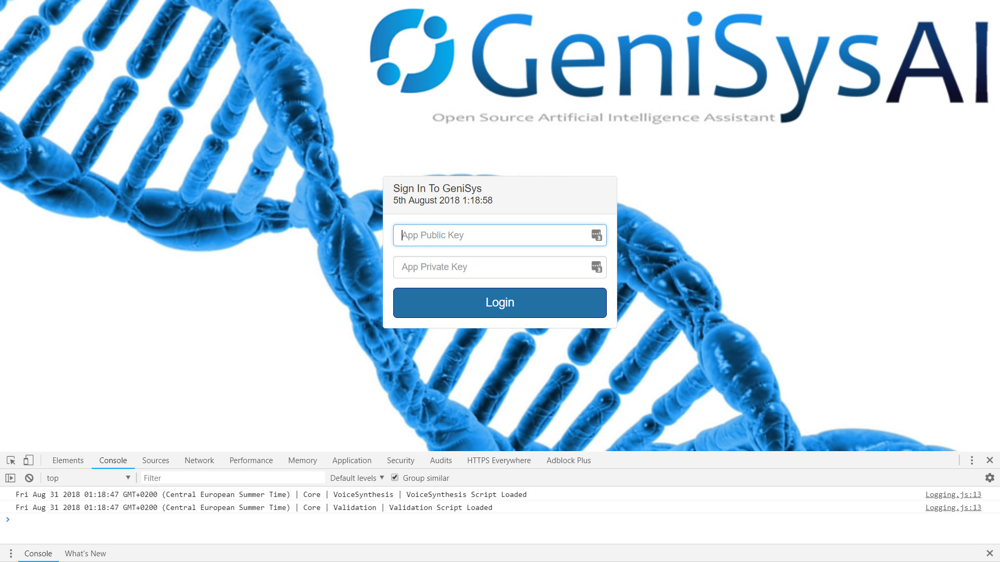

# GeniSys AI Server
[](https://github.com/GeniSysAI/Server)

[](https://github.com/GeniSysAI/Server/tree/0.0.1)

## About GeniSys AI

GeniSys AI is an open source Artificial Intelligence Assistant Network using Computer Vision, Natural Linguistics and the Internet of Things. GeniSys uses a system based on [TASS A.I](https://github.com/TASS-AI/TASS-Facenet "TASS A.I") for [vision](https://github.com/GeniSysAI/Vision "vision"), an [NLU engine](https://github.com/GeniSysAI/NLU "NLU engine") for natural language understanding, in browser speech synthesis and speech recognition for speech and hearing, all homed on a dedicated Linux server in your home and managed via an online operating system.

## About GeniSys AI Server
[](https://github.com/GeniSysAI/Server)

[GeniSys AI Server](https://github.com/GeniSysAI/Server "GeniSys AI Server") is a customisable management system for [GeniSys AI](https://github.com/GeniSysAI/Server "GeniSys AI") networks. The GeniSys management system is built on top of [Ubuntu 18.04.1 LTS (Bionic Beaver)](http://releases.ubuntu.com/18.04/ "Ubuntu 18.04.1 LTS (Bionic Beaver)"), but there should be no issues using other Linux operating systems. The server uses a secure PHP/MySql Nginx server, [Let’s Encrypt](https://letsencrypt.org/ "Let’s Encrypt") for free SSL encryption, and free IoT connectivity via the [iotJumpWay](https://www.iotJumpWay.tech "iotJumpWay").

Although the completed GeniSys Server will be accessible via the outside world, this is only to help ensure encrypted traffic over your local network. It is suggested that the UI is only accessed on the local IP, the Nginx server will proxy traffic to your internal IPs for features such as the NLU and the internal TASS camera will access the local camera of the device the program is running on.

# What Will We Do?

This tutorial will help you setup the server required for your GeniSys network, and also takes you through setting up iotJumpWay devices and applications. In detail this guide will cover the following:

- Installation: Ubuntu 18.04, Nginx, Let's Encrypt, PHP, MySql, phpMyAdmin, IP tables
- Setup: Domain name & DNS configuration, router port forwarding, IP tables security, Device Proxy

# Installation & Setup

The following guides will give you the basics of setting up a GeniSys Server. 

## Install Ubuntu 18.04

For this project, the operating system of choice is  [Ubuntu 18.04.1 LTS (Bionic Beaver)](http://releases.ubuntu.com/18.04/ "Ubuntu 18.04.1 LTS (Bionic Beaver)"). To get your operating system installed you can follow the [Create a bootable USB stick on Ubuntu](https://tutorials.ubuntu.com/tutorial/tutorial-create-a-usb-stick-on-ubuntu#0 "Create a bootable USB stick on Ubuntu") tutorial.

## Setup Domain Name

Now is as good a time as any to sort out and configure a domain name. You need to have your domain already hosted on a hosting account, from there edit the DNS zone by adding an A record to your public IP, for this you need a static IP or IP software that will update the IP in the DNZ Zone each time it changes.

Once you have done this your domain name or subdomain will be pointing towards your public IP, if port 80 and 443 are not currently listening for traffic then visiting your domain name will result in a timeout for now.

## Install Nginx

Now it is time to install Nginx, follow the commands below to install the required software.

```
 $ sudo apt-get install nginx
 $ sudo cp /etc/nginx/sites-available/default /etc/nginx/sites-available/default.backup
 $ sudo systemctl status nginx.service
 $ sudo nano /etc/nginx/sites-available/default 
 $ sudo nginx -t
 $ sudo systemctl reload nginx
```

What the above commands do is:

- Installs Nginx
- Makes a copy of the default Nginx configuration named default.backup
- Checks the status of the service (server)
- Here you need to edit the default Nginx configuration replacing example.com in server_name (example.com www.example.com)
- Checks if the configuration is OK
- Reloads the Nginx service

## Setup Port Forwarding

Now we have your domain pointing to your public IP, it is time to add a port forward, traffic to your network will be coming from port 80 (insecure) and secure. Although Nginx will bounce the insecure traffic to port 443, we still need to add a port forward for port 80 as well as 443. How you will do this will vary, but you need to find the area of your router that allows you to add port forwards, and then add one port forward for incoming insecure traffic to port 80 of the server, and one for port 443. This will open the HTTP ports on your router and forward the traffic to the same ports on your server. In the case someone tries to access using insecure protocol (http - port 80) they will be automatically be sent to the secure port of the server (https - 443)

## Install Let's Encrypt

Security is everything, and it is even better when security is free ;) To encrypt our network we are going to use SSL provided by [Let’s Encrypt](https://letsencrypt.org/ "Let’s Encrypt"). Follow the commands below to set up Let’s Encrypt.

```
 $ sudo add-apt-repository ppa:certbot/certbot
 $ sudo apt-get update
 $ sudo apt-get install python-certbot-nginx
```

If you have followed above correctly you should now be able to access your website, but only using the secure protocol, 443, ie: https. If you visit your site you should now see the default Nginx page.

# Contributing
Please read **CONTRIBUTING.md** for details on our code of conduct, and the process for submitting pull requests to us.

# Versioning
We use SemVer for versioning. For the versions available, see the tags on this repository.

# License
This project is licensed under the **MIT License** - see the **LICENSE.md** file for details

# Bugs/Issues

We use issues to track bugs and general requests related to using this project.

# Author

[](https://github.com/AdamMiltonBarker)


